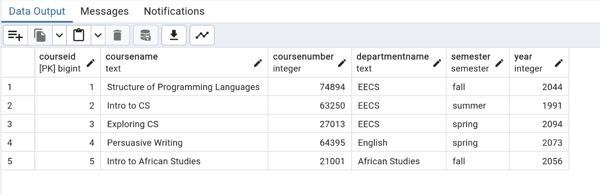
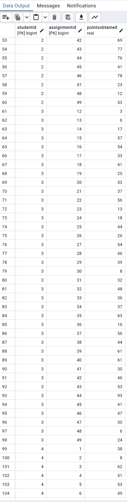
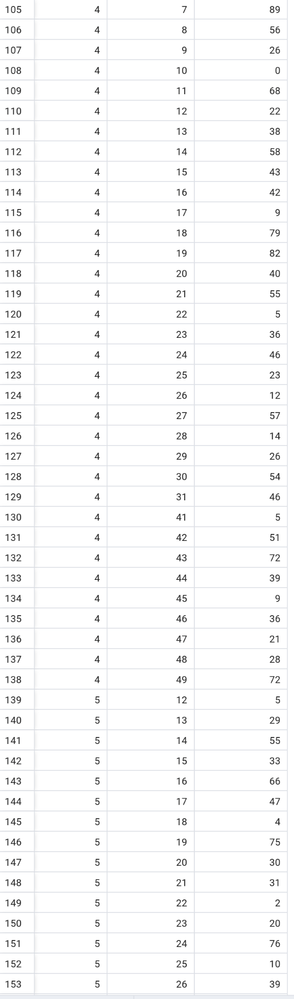
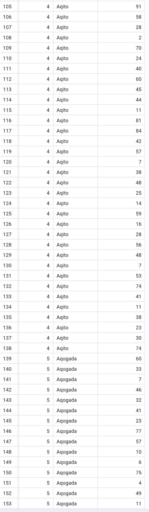

# GradeBook

# This repo contains the project work for the Database Systems course for Group 18

# About the files and folders in this repository:

### 1. ERD.png:

It is the ERD diagram for the project.

### 2. create_tables.sql:

It contains the queries to create the tables and relations given in the ERD diagram.

### 3. insert.sql:

It contains the queries to add mock data to the database.

### 4. questions.sql:

It contains the responses to the questions given in the project. The queries are separate by their respective question numbers using comments.

### 5. images_for_inserted_values/:

It is a folder that contains images that shows the tables after queries in the **insert.sql** file has been run. Each image files' name corresponds to the table it refers to. If the table is to big for one picture, it is split into multiple files.

### 6. question_solution_images/:

It is a folder that contains images of test cases to validate the data after running the queries in **questions.sql**. The filename of each image corresponds to the respective question. If more than one test case is required for a particular question, it is split into multiple files.

# Instructions to run:

Install a Database Management System (DBMS): Begin by installing PostgreSQL on your computer. You can find installation instructions on the official websites of these systems.

### Open the DBMS Client and Connect to the Database:
Install, open and configure pgadmin and create a db server with a database called 'proj'.

### Create the database schema:
Run the queries in **create_tables.sql** to initialize the database with the correct schema that correspond to the entities in the ERD diagram given in this repository.

### Add mock data to the database table:
Run all the queries in **insert.sql** to add mock data to the tables. 

### Run queries in question.sql:
The queries in this file are solutions to the problems given in the project. Running each query will give the solution to the respective problem.

# Problem Statement
You are asked to implement a grade book to keep track student grades for several couses that a professor teaches. Courses should have the information of department, course number, course name, semester, and year.  For each course, the grade is caculated on various categories, including course participations, homework, tests, projects, etc.  The total percentages of the categories should add to 100% and the total perfect grade should be 100. The number of assignments from each category is unspecified, and can change at any time.  For example, a course may be graded by the distribution: 10% participation, 20% homework, 50% tests, 20% projects. Please note that if there are 5 homework, each homework is worth 20%/5=4% of the grade.

# Tasks and their responses/solutions:
## 1. Design the ER diagram:

The ERD Diagram is given below:

## 2. Write the commands for creating tables and inserting values

Commands for creating tables is located in the file **create_tables.sql** and the commands for inserting mock values into the tables is given in the **insert.sql** file

## 3. Show the tables with the contents that you have inserted;

The images that show the inserted data is located in the folder **images_for_inserted_values**

They are also given below:

### Results after inserting Data into Students table:

### Results after inserting Data into Courses table:

### Results after inserting Data into Enrollments table:

### Results after inserting Data into Distributions table:

### Results after inserting Data into Assignments table:

### Results after inserting Data into StudentGrades table:

## 4. Compute the average/highest/lowest score of an assignment
### Results(Test case) after running query for  question 4:

The diagram shows the average, maximum, and minimum scores for assignments with the asssignment id 2.

## 5. List all of the students in a given course;

The result shows all the students in the course 'Structures of Programming Languages'. Comparing with the data in the enrollment table, we see that only 2 students are enrolled in the class.

### Results(Test Case) after running query for  question 5:

## 6. List all of the students in a course and all of their scores on every assignment;
### Results(Test Case) after running query for  question 6:
We know that the course with courseID = 1 only has two students. From comparing with the assignments table and studentgrades table we see that the query accurately retrieves all the scores on every assignment of the students in the course.

## 7. Add an assignment to a course;

The image shows the data inserted into the assignment table. 

### Results(Test Case) after running query for question 7:

## 8. Change the percentages of the categories for a course;

The image shows the updated data in the distribution table for the course with course id 4.
### Results(Test Case) after running query for question 8:

## 9. Add 2 points to the score of each student on an assignment;

From the assignments table we see that assignment with assignmentID 5 belongs to course with courseID 1. This only has 2 students(refer to question 5). Comparing with the student grades table(rows 5 and 103) we see that 2 points is increase for each student.

### Results(Test Case) after running query for question 9:

## 10. Add 2 points just to those students whose last name contains a ‘Q’.

Comparing with the StudentGrades Table, we see that only the the grades of students with last name containing 'Q' or 'q' have had their points increased by 2 points
### Results(Test Case) after running query for question 10:

## 11. Compute the grade for a student;

### Results(Test Case) after running query for question 11:

Calculating the grade of the student from the grades table manually, we can verify this information:

#### Getting the grades for all the courses a particular student is enrolled in:

#### Getting the grades for a given course taht a particular student is enrolled in:

## 12. Compute the grade for a student, where the lowest score for a given category is dropped.

### Results(Test Case) after running query for question 12:

**NOTE:** If you compare with the results from question 11, you observe that the grade is increase by the correct amount.